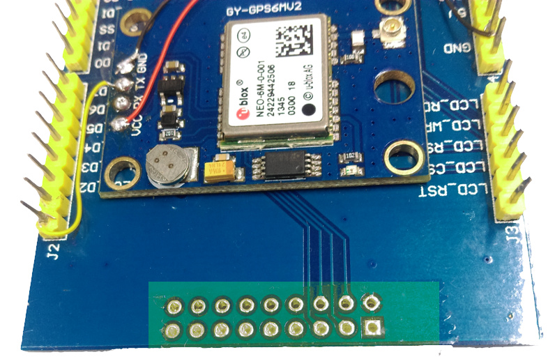
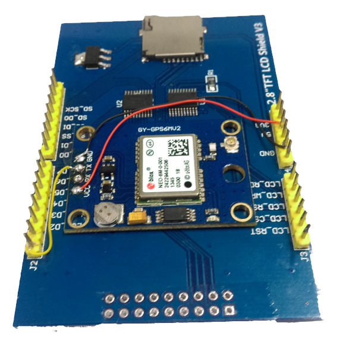
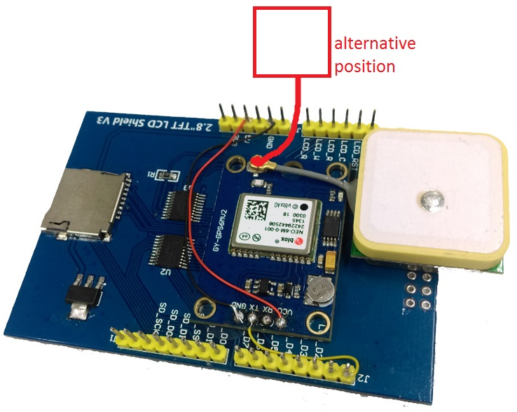
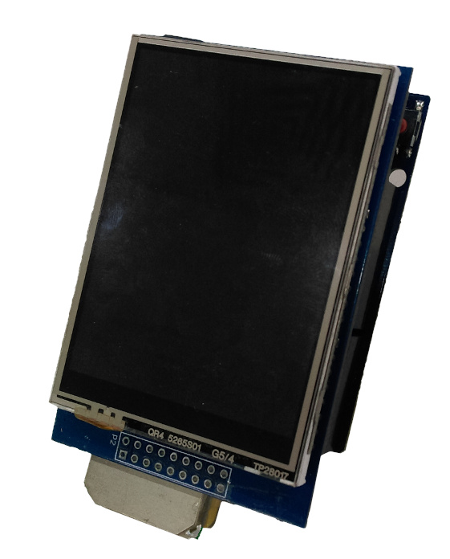

# GPS Speedometer

Using our Arduino-compatible GPS module and TFT Screen, this project displays basic GPS information such as longitude, latitude, altitude, speed, and distance travelled from point A to B. Information are stored on an SD card which can be exported and viewed via Google Maps. Powered from a micro-USB for easy powering off your phone charger while you’re in the car.			

* Due to the limited size of the Arduino, we've separated the code into two code blocks:
    * `gps_speedo` for the gps speedometer
    * `gps_recorder` record the gps trip
* While it *is* possible to fit the two into one sketch, it's a tight fit and not very suitable for beginners. You are welcome to try though and see what you can conjure up. We've found this way is simpler and easy for you to dig through without having to worry about removing bootloaders or otherwise.

## Bill of Materials
| Qty | Product | Description |
| --- | ---- | --- |
|1 | [XC4430](https://jaycar.com.au/p/XC4430) | Duinotech Leonardo  |
|1 | [XC3712](https://jaycar.com.au/p/XC3712) | GPS Receiver module |
|1 | [XC4630](https://jaycar.com.au/p/XC4630) | 2.8" TFT LCD screen. |
| | | Some double sided and single sided tape |

#### Suggested Extras
* [WW4345](https://jaycar.com.au/p/WW4345) Wire wrap (use any colour)
    * Very thin wire that's perfect for small builds.
* [XC4983](https://jaycar.com.au/p/XC4983) 8GB SD card.
    * Use for logging GPS data.

## Required Software and Libraries
_Version numbers are at the time of this guide and might or might not work with later version._

| Library | Author |  Version |
| :---|:--- | --- |
| NeoGps | SlashDevin | 4.2.9 |
| NeoHWSerial | SlashDevin | Latest Github https://github.com/SlashDevin/NeoHWSerial |
| MCUFRIEND_kbv | David Prentice | 2.9.8 |
| SdFat | Bill Greiman | 1.0.7 |


#### Notes

* **NeoGps** and **NeoHWSerial** are needed to run the GPS module, the **NeoHWSerial** library is a custom library that isn't yet in the library manager, but is needed to enable interrupt processing on the `Serial` line. 

* You must modify line 150 of `NMEAGPS_cfg.h` to read:

```
#define NMEAGPS_INTERRUPT_PROCESSING
```

* You must also modify 159-161 of `GPSport.h` to read:
```c
  #include <NeoHWSerial.h>    // NeoSerial or NeoSerial1 Interrupt-style processing
  //#include <AltSoftSerial.h>    // <-- DEFAULT.  Two specific pins required
  //#include <NeoICSerial.h>    // AltSoftSerial with Interrupt-style processing (see docs)
```

* **MCUFRIEND_kbv** needs to be modified to work with our TFT module. Read more [Here](https://github.com/Jaycar-Electronics/databook/blob/master/modules/XC4630.md)

* **SdFat** provides us with an interface to `FAT32` filesystems _as well as_ provides a **SoftwareSPI** bus. We use 'SoftSPI' due to the case that Leonardo does not have the SPI pins on 10~13 as traditional UNOs do. This library is perfect for our needs.

* To enable, change line 85 of `documents/libraries/SdFat/src/SdFatConfig.h` to read:
```c
#define ENABLE_SOFTWARE_SPI_CLASS 1
```

## Connection Table

| GPS module | TFT Screen  |
| :------------- | :------------- |
| TX | Pin0 (unlabeled, next to J2)|
| VCC | 5V |
| GND | GND|

That's all there is to it, one connection (aside from power)

## Assembly

To make the unit neat and organised, we're attaching the GPS module underneath the TFT screen. seeming there's only one connection, this is non-trivial.

First we'll use some single-sided tape to cover the connection pads that are at the bottom of the TFT screen.



_The tape is a bit transparent so we coloured it in for you_

Next we'll remove the solder connections from the GPS module, if you're unsure, follow the [Guide](https://github.com/Jaycar-Electronics/databook/blob/master/tutorial/Removing%20Headers.md)

Then attach the module board to the underside of the TFT screen, in a suitable location, and solder the wires to where they have to go. For this, I used wire-wrap, which is very small, and fairly easy to work with if you manage to strip them without cutting the super-thin cable.



_Connections to the GPS module that has been double-sided taped to the TFT module_

The only final thing is the antenna. There's two locations for this, depending on whether you want to mangle your Leonardo or not. I opted to do it, by removing the ISCP connector from the Leonardo, giving room for the antenna to sit underneath the bottom of the TFT screen and using a small bit of tape to keep it in place. you can also sit it out to the side if you want, but be sure not to bump it around too much as the antenna lead is very thin and not designed to take stress.



_Picture of how we set it up by removing the ISCP. if you don't want to remove the ISCP, you can use the alternative position but it's recommended to support the antenna in some way so it doesn't move around_

That's it! you're done.



## Programming

Programming has been done for you, so simply download the code and upload from the Arduino. Make sure to select the correct board ( `Yun` or `Leonardo`) and the correct Port.

At the top of the code is `TZ_OFFSET` which is set to `39600` - this is 39600 seconds from UTC, or +11 hours `AEDT` for Sydney daylight saving time. Use this to change your Time zone so it shows the correct time, for instance:

* If you are in Brisbane: you can use `+11 * 60 *60 = 39600` for `AEST`

* If you are in Washington (daylight saving): you can use `-4 * 60 * 60 = -14400` for `EDT`


## Use

The `GPS_speedo` program will boot up and automatically tell you your location and speed.
`GPS_recorder` will log your trip info to SD card with standard `KVML` format as used by Google Maps.

## Contribution

We welcome suggestions and improvements to the code, send in a pull request and we'll review it to merge into main branch.
